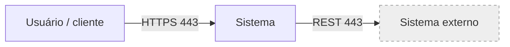
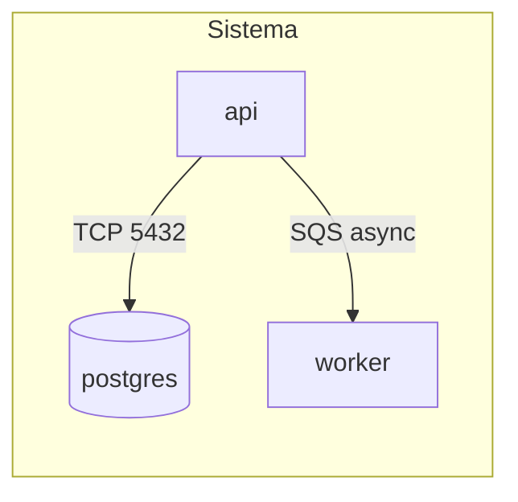
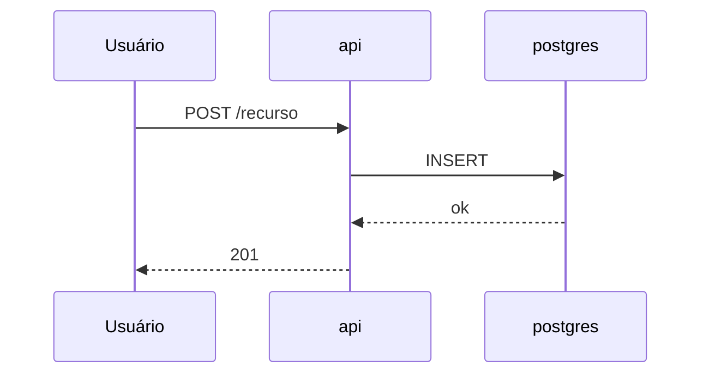
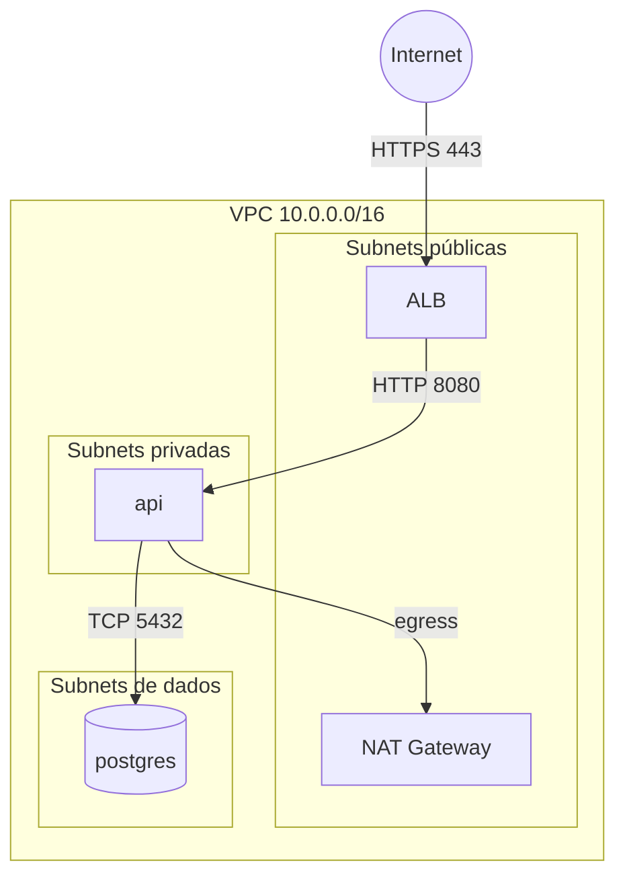

## Informações Básicas
- **Autor:** [nome — função/time]
- **Data:** [AAAA-MM-DD]
- **Status:** Atual / Parcialmente desatualizado / Obsoleto
- **Escopo:** [o que este documento cobre — e o que fica de fora]
- **Público:** [quem vai ler: dev novo no time, outro squad, SRE, auditoria,
  gestão — define a profundidade do resto]
- **Fontes:** [repos, pastas de IaC, consoles, pessoas consultadas — com data]
- **Relacionados:** [RFCs, runbooks, ADRs, dashboards]

---

## Resumo

Três a cinco linhas que respondem: o que é, pra que serve, quem usa, onde
roda e qual a peça central. Quem ler só isso tem que sair com o modelo
mental certo.

---

## Contexto

O sistema visto de fora, como uma caixa só: quem usa e do que ele depende.

| Ator / Sistema externo | Relação com o sistema | Protocolo | Dono |
|---|---|---|---|
| [nome] | [consome / é consumido / notifica] | [HTTPS, gRPC, SFTP...] | [time/empresa] |

---

## Componentes

Abre a caixa: as peças internas e quem chama quem.

| Componente | O que faz e por que existe | Tecnologia | Onde roda | Dono |
|---|---|---|---|---|
| [nome igual ao do diagrama] | [responsabilidade + motivo] | [linguagem, engine, versão] | [EKS, Lambda, EC2, VM...] | [time] |

---

## Fluxos Principais

Os caminhos que mais importam (o que mais roda, o que dá dinheiro, o que
mais quebra). Um `###` por fluxo.

### F1 — [nome do fluxo]

1. [passo em prosa curta, dizendo sync/async e onde fica o estado]
2. [passo]

**Se um passo falha:** [timeout, retry, fila morta, erro pro usuário —
o que acontece de fato]

---

## Infraestrutura e Rede

### Ambiente

| Item | Valor |
|---|---|
| Cloud / conta / projeto | [AWS conta X, GCP projeto Y] |
| Região / AZs | [us-east-1, a/b/c] |
| Ambientes | [prod, uat, dev — e o que muda entre eles] |
| IaC | [pasta/repo do Terraform, Helm, etc.] |

### Topologia

### Endereçamento e portas

| Origem | Destino | Porta / Protocolo | Controle |
|---|---|---|---|
| [ALB] | [api] | [8080/TCP] | [SG sg-xxx, NetworkPolicy, firewall rule] |

### Entrada, saída e DNS

- **Entrada:** [por onde o tráfego chega — CDN, WAF, LB, API Gateway, VPN]
- **Saída:** [como o sistema sai pra internet/parceiros — NAT, proxy, IP fixo]
- **DNS:** [zonas públicas/privadas, quem resolve o quê]
- **Conectividade com outras redes:** [peering, Transit Gateway, VPN,
  PrivateLink, Direct Connect]

---

## Dados

| Dado | Onde vive | Engine / formato | Volume | Retenção | Backup | Classificação |
|---|---|---|---|---|---|---|
| [pedidos] | [RDS prod] | [Postgres 16] | [~200 GB] | [5 anos] | [snapshot diário, 7 dias] | [PII / interno / público] |

Quem é a fonte da verdade de cada dado, como ele se replica ou sincroniza,
e onde a consistência é eventual.

---

## Segurança

### Fronteiras de confiança

- **T1.** [internet → ALB]: [TLS terminado no ALB, WAF com regras X]
- **T2.** [api → banco]: [subnet isolada, SG só aceita da api, TLS]

### Autenticação e autorização

[Como usuários e serviços provam quem são (OIDC, JWT, mTLS, IAM role) e
onde a permissão é checada.]

### Secrets e criptografia

[Onde vivem os secrets (nome no Secrets Manager/Vault, nunca o valor), quem
acessa, rotação. Criptografia em trânsito (onde tem TLS e onde não tem) e em
repouso (KMS, chave gerenciada ou própria).]

---

## Operação e Resiliência

### Escala e capacidade

[Réplicas, autoscaling (métrica e limites), RPS/volume típico e de pico.]

### Observabilidade

[Onde ficam logs, métricas, traces, dashboards e alertas — com link.]

### Modos de falha

| Falha | Efeito pro usuário | Como o sistema reage | Runbook |
|---|---|---|---|
| [banco indisponível] | [erro 503 no checkout] | [api falha rápido, sem retry] | [link] |

### Limites conhecidos

- **L1.** [SPOF, quota, gargalo ou dívida técnica]. *Impacto: Alto/Médio/Baixo.*

---

## Decisões e Trade-offs

- **D1.** [decisão — ex.: "fila SQS entre api e worker em vez de chamada
  síncrona"]. **Por quê:** [motivo]. **Custo aceito:** [o que se perdeu].
  **Alternativa descartada:** [qual e por quê]. [link do RFC, se houver]

---

## Glossário e Lacunas

### Glossário

| Termo | Significado neste contexto |
|---|---|
| [sigla ou termo] | [explicação curta] |

### Lacunas

- **Q1.** [o que não foi possível confirmar] — confirmar com [pessoa/time]
  ou em [console/repo]
