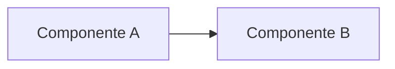
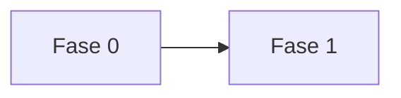

## Informações Básicas
- **Autor:** [nome — função/time]
- **Data:** [AAAA-MM-DD]
- **Status:** Em Discussão / Aprovado / Rejeitado / Implementado
- **Área:** [time ou domínio]

---

## Contexto e Problema

Descreva o cenário atual e por que ele é um problema. Inclua números reais
(custo, volume, latência, contagem) sempre que existirem — eles fazem a
diferença entre "isso é lento" e "isso adiciona 400ms em 60% das chamadas".

### Arquitetura atual

Se a RFC envolve sistemas, inclua um diagrama (mermaid `flowchart`) mostrando
como funciona hoje. Destaque visualmente (cor) os pontos problemáticos.

**Como funciona hoje:**

Descreva o fluxo atual em prosa ou bullets, explicando o "porquê" das decisões
que existem hoje (mesmo que pareçam estranhas — geralmente havia um motivo).

### Problemas identificados

Liste cada problema separadamente e numerado. Um problema por item, não
misture causas diferentes num só bullet.

1. **[Nome curto do problema].** Explicação com impacto concreto.
2. **[Nome curto do problema].** Explicação com impacto concreto.

**Por que isso importa agora:**

- Urgência ou janela de tempo (ex.: sazonalidade, deadline externo)
- Custo/risco de não agir
- Restrições que a solução precisa respeitar (compatibilidade, migração sem
  perda de dado, etc.)

---

## Solução Proposta

Resumo de uma ou duas frases do que está sendo proposto, antes de entrar em
detalhe. Depois, descreva por componente/etapa.

### Visão de arquitetura proposta

### Componentes e responsabilidades

| Componente | Papel | Substitui / Convive com |
|---|---|---|
| [nome] | [o que faz] | [Novo / Substitui X / Mantido] |

Adicione subseções (`###`) para cada parte relevante da proposta — ex.:
divisão lógica, padronização, plano de migração, automações. Use o nível de
detalhe necessário para alguém implementar sem precisar perguntar de volta.

---

## Escopo

### O que está incluído
- **O1.** [objetivo concreto e verificável]
- **O2.** [objetivo concreto e verificável]

### O que NÃO está incluído
- **N1.** [o que fica de fora, e por quê]
- **N2.** [o que fica de fora, e por quê]

---

## Impacto e Riscos

### Impactos Positivos
- [benefício concreto]

### Riscos Identificados
- **R1.** [risco]. *Impacto: Alto/Médio/Baixo.*
- **R2.** [risco]. *Impacto: Alto/Médio/Baixo.*

### Mitigações
- **R1.** [como mitigar — mesma numeração do risco acima]
- **R2.** [como mitigar]

---

## Plano de Implementação

[Meta geral e recursos disponíveis em uma linha.]

| Etapa | Responsável | Prazo Estimado | Dependências |
|-------|-------------|----------------|---------------|
| **Fase 0 — [nome]:** [o que entrega] | [time] | [prazo] | — |

**Sequenciamento:**

**Dependências:**

- **D1.** [o que precisa estar resolvido antes, e status atual]

---

## Métricas de Sucesso

- **CS1.** [como saber que funcionou — verificável, não vago]
- **CS2.** [idem]

---

## Discussão e Feedback

**Resolvidas:**

1. [pergunta/decisão] — decidido: [o quê]

**Em aberto:**

1. [o que ainda não está decidido e precisa de input de quem revisa]
