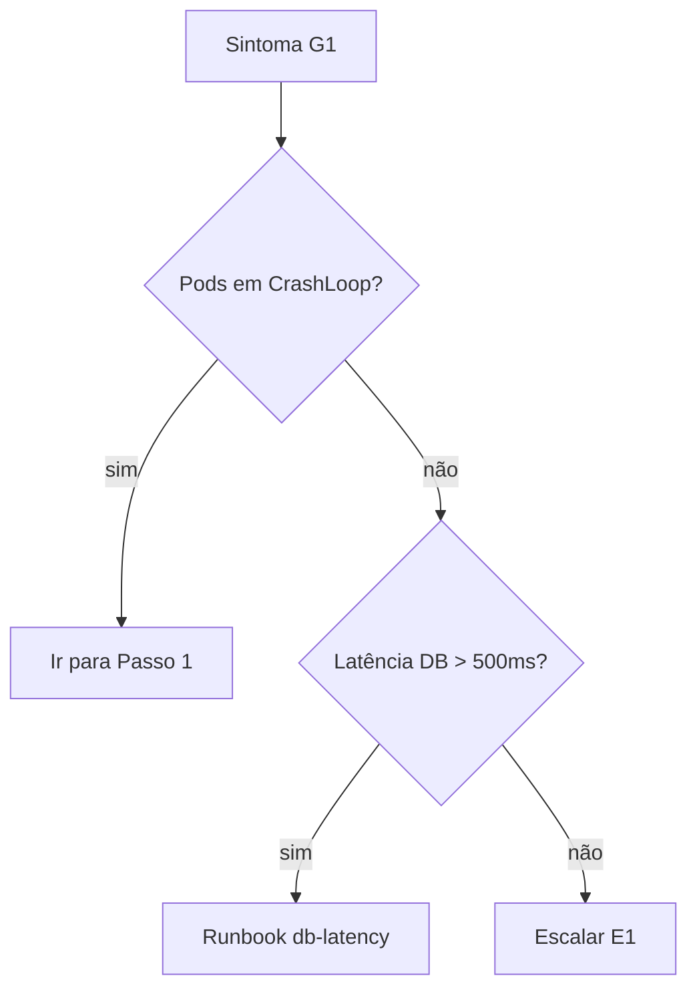

## Informações Básicas
- **Dono:** [nome — time]
- **Sistema:** [serviço/componente afetado]
- **Severidade típica:** SEV1 / SEV2 / SEV3 / Rotina
- **Tempo estimado:** [total, ex.: 15 min]
- **Última revisão:** [AAAA-MM-DD]
- **Último teste real:** [AAAA-MM-DD — ou "nunca testado"]
- **Links:** [dashboard, alerta, RFC/postmortem relacionado]

---

## Quando Usar

### Gatilhos
- **G1.** [alerta/sintoma observável, ex.: alerta `PaymentAPIHighErrorRate` disparou]
- **G2.** [outro sintoma, ex.: `/health` retorna 503 por mais de 2 min]

### Quando NÃO usar
- [situação parecida que tem outro runbook — linke]
- [situação em que este procedimento piora o problema]

---

## Pré-requisitos

| ID | O que | Como obter / verificar |
|----|-------|------------------------|
| **P1** | [acesso, ex.: kubectl no cluster `prod-east`] | [ex.: `aws eks update-kubeconfig ...`; pedir em #infra-access] |
| **P2** | [ferramenta + versão] | [comando de instalação/verificação] |
| **P3** | [secret/credencial — só onde buscar, nunca o valor] | [ex.: Vault `secret/prod/payment/db`, chave `password`] |

---

## Diagnóstico

Confirme que é este o problema antes de agir. Cada verificação tem comando,
o que olhar na saída e o que significa.

**1. [O que verificar]**
```bash
[comando]
```
Esperado: [valor/saída normal]. Se [saída anormal] → este runbook se aplica.
Se [outra saída] → não é este problema, veja [outro runbook / Escalonamento].

Se há ramificação, desenhe:



---

## Procedimento

### Passo 1 — [ação em imperativo, uma só]

```bash
[comando copiável]
```
Placeholders: `<POD>` = nome obtido no Diagnóstico item 1.

**Esperado:** [saída/status que confirma sucesso].
**Se falhar:** [repetir uma vez / pular para Passo N / ir para Rollback / escalar E#].
**Tempo:** [~X min]

### Passo 2 — [ação]

> **ATENÇÃO:** [o que este comando destrói/perde e por que é irreversível].
> Antes, rode: `[comando de dry-run / backup]`

```bash
[comando]
```

**Esperado:** [...]
**Se falhar:** [...]

---

## Verificação

Como saber que resolveu. Comando + valor esperado, não "funcionou".

- **V1.** `[comando]` → deve retornar [valor]. Aguardar até [X min].
- **V2.** Dashboard [link] — métrica [nome] abaixo de [valor] por [tempo].
- **V3.** Alerta [nome] resolvido automaticamente.

Se alguma V# não passar após [tempo]: ir para Rollback ou escalar E#.

---

## Rollback

Como desfazer, na ordem inversa quando fizer sentido. Cada passo com a mesma
anatomia do Procedimento (comando, esperado, se falhar).

### Passo R1 — [ação]
```bash
[comando]
```
**Esperado:** [...]
**Se falhar:** escalar E#.

Se o rollback não é possível, diga em destaque: o que não tem volta, e o que
fazer no lugar.

---

## Escalonamento

Quando escalar: [critério objetivo, ex.: V1 não passou após 15 min, ou
qualquer passo falhou duas vezes].

| Nível | Quem | Canal | Horário | Quando |
|-------|------|-------|---------|--------|
| **E1** | [time/pessoa] | [#canal / pager] | [24x7 / comercial] | [critério] |
| **E2** | [time/pessoa] | [#canal / pager] | [horário] | [critério] |

Ao escalar, informe: qual runbook, em qual passo parou, saída do último
comando, o que já foi tentado.

---

## Pós-ação e Histórico

### Pós-ação
- [ ] Atualizar status no [canal de incidente / status page]
- [ ] Abrir/atualizar ticket em [sistema]
- [ ] Se SEV1/SEV2: agendar postmortem
- [ ] Se algum passo divergiu do runbook: corrigir este documento

### Problemas conhecidos
- **K1.** [situação que já aconteceu ao executar] — contorno: [o quê]

### Histórico de execuções

| Data | Quem | Resultado | Observação |
|------|------|-----------|------------|
| [AAAA-MM-DD] | [nome] | ok / rollback / escalado | [o que divergiu] |
